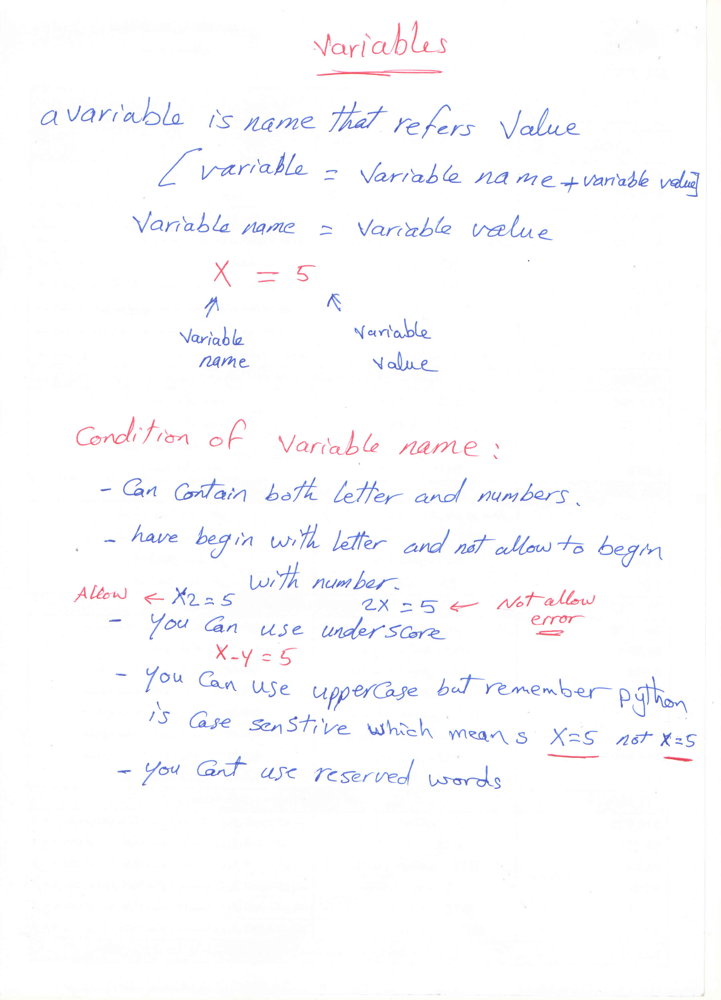

### Python Variables

##### a variable is name that refers value 

###### [ Variable = Variable name + variable value ]

###### Variable name = Variable value

```python
x = 5
```

###### x = variable name     5 = Variable value

----------------------------------------------------------------------------------------------------------------------------------

##### Condition of variable name :

1. Can contain both letter and numbers

2. Have begin with letter and not allow to begin with number 

   ```python
   #Allowed variable
   x2 = 5
   #Not allowed variable
   2x = 5
   ```

3. You can use underscore 

   ```python
   x_y = 5
   ```

   

4. You can use uppercase but remember python is case sensitive which means  

   ```python
   x = 5
   X = 10
   ```

   

5. You cant use reserved words

   
   
   

------------------------------------------------------------------------------------------------------------------------------------------------------------

##### Variables Examples :

```python
X = 10
x = 12
x2 = 6
2x = 8   #Error Not allowed variable name
 
```

##### Assigning values to variables :

1. ###### Single Assignment

   ```python
   x = 5
   s = 'Welcome'
   ```

   

2. ###### Multiple Assignment

   ```python
   x , y = 5 , 6					# Mean x = 5  and y = 6
   a = b = c = 1					# Mean a = 1  and   b = 1 and c = 1
   ```

--------------------------------------------------------------------------------------------------------------------------------------------------

##### Python variable Types :

1. int 	: For integer numbers                                      ex :          x = 5
2. str     : For Strings                                                        ex :          x = "Mohamed Gouda"
3. float  : For float numbers                                           ex:           x = 5.20
4. bool  : For bool [True / False ]                                   ex:            x = False
5. list     : For list of values                                              ex:            x = [5 , 3 , 'Ahmed','Ali]      # Can be edited
6. tuple : For list of values                                              ex:            x = (5 , 4 , 6)      # Cant be edited
7. dict    : For list of values                                              ex:            x = { 1: 'Ahmed' , 2: 'Mohamed' }

##### Example :

```python
x = 5
z = 'Mohamed'
n = 2.50
a = (2,5,6)
b = [1 , 2 , 3]
c = {1:'Ahmed' , 2:'Ali'}

type(x)
<class 'int'>
type(z)
<class 'str'>
type(n)
<class 'float'>
type(a)
<class 'tuple'>
type(b)
<class 'list'>
type(c)
<class 'dict'>
```

<<<<<<< HEAD

=======

>>>>>>> c78dba0274f03dba9d788fb5f8cd73902b459cd5
