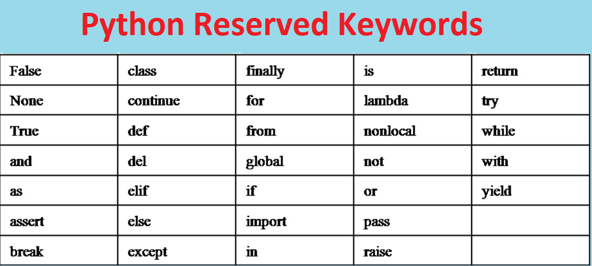

### Python Variables

##### a variable is name that refers value 

###### [ Variable = Variable name + variable value ]

###### Variable name = Variable value

```python
x = 5
```

###### x = variable name     5 = Variable value

----------------------------------------------------------------------------------------------------------------------------------

##### Condition of variable name :

1. Can contain both letter and numbers

2. Have begin with letter and not allow to begin with number 

   ```python
   #Allowed variable
   x2 = 5
   #Not allowed variable
   2x = 5
   ```

3. You can use underscore 

   ```python
   x_y = 5
   ```

   

4. You can use uppercase but remember python is case sensitive which means  

   ```python
   x = 5
   X = 10
   ```

   

5. You cant use reserved words

   


